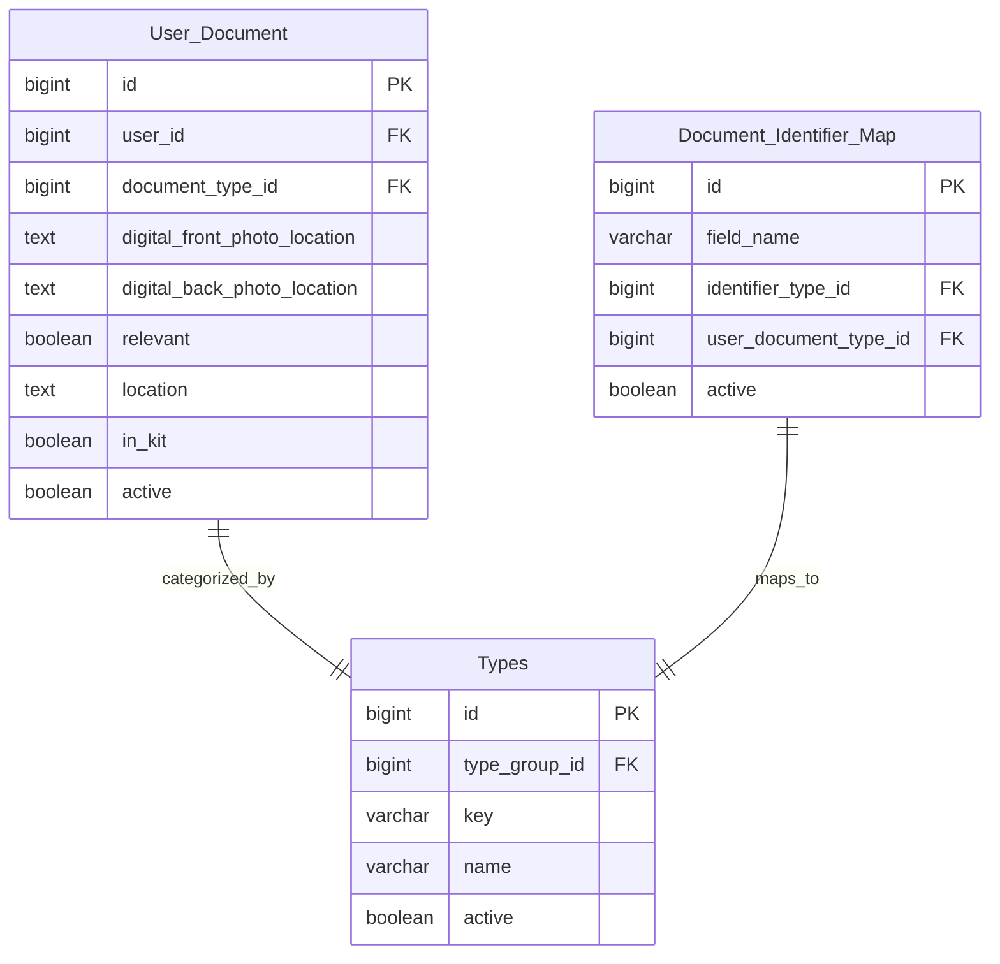

# Product Requirements Document (PRD)

# 1. INTRODUCTION

## 1.1 Purpose
This Product Requirements Document (PRD) specifies the requirements for the EstateKit Personal Information API system. It serves as the primary reference for technical teams implementing the system and stakeholders involved in the project. The document details functional requirements, data structures, and technical specifications required to build two interconnected APIs - a business logic GraphQL API and a data access REST API.

## 1.2 Scope
The EstateKit Personal Information API system encompasses:

- A GraphQL API service that handles business logic for personal information management, including:
  - Secure retrieval of user personal information
  - Creation and updates of user data
  - Document processing and storage
  - OCR processing of government IDs
  - Integration with encryption services

- A REST API service that manages data access, including:
  - Direct database interactions with the EstateKit database
  - Encryption/decryption of sensitive data fields
  - Data validation and security checks
  - OAuth authentication enforcement

The system will enable:
- Secure storage and retrieval of personal information
- Management of government identifiers and documents
- Handling of family relationships and contact information
- Storage of important document locations and access details
- Integration with front-end applications (web and mobile)
- Secure document storage in AWS S3
- Automated extraction of data from government IDs

The system explicitly excludes:
- Direct database access from any service other than the data API
- User interface components
- Authentication provider implementation
- Direct encryption/decryption service implementation

# 2. PRODUCT DESCRIPTION

## 2.1 Product Perspective
The EstateKit Personal Information API system consists of two interconnected APIs that operate within the larger EstateKit ecosystem:

1. Business Logic GraphQL API
- Interfaces with front-end web and mobile applications
- Communicates with the Data Access API
- Integrates with AWS S3 for document storage
- Connects with AWS Textract for OCR processing
- Operates in a dedicated VPC

2. Data Access REST API
- Operates in a separate VPC
- Sole interface to the EstateKit database
- Integrates with the EstateKit encryption/decryption service
- Interfaces with three databases:
  - estatekit (personal information)
  - eksecurity (security information)
  - ekvault (encryption/decryption keys)

## 2.2 Product Functions
- Personal Information Management
  - Create, read, update, and delete personal data
  - Handle sensitive data encryption/decryption
  - Process and store government IDs and documents
  - Manage family relationships and contact information
  - Track important document locations

- Document Processing
  - Upload and store documents in AWS S3
  - OCR processing of government IDs using AWS Textract
  - Automated data extraction from identification documents
  - Digital document location tracking

- Security Operations
  - OAuth authentication enforcement
  - Field-level encryption of sensitive data
  - Secure data transmission between APIs
  - Access control validation

## 2.3 User Characteristics
Primary Users:
- Front-end Developers
  - Experience with GraphQL APIs
  - Building web and mobile applications
  - Understanding of OAuth authentication

- System Integrators
  - Experience with REST APIs
  - Understanding of database operations
  - Knowledge of security protocols

- Security Administrators
  - Monitoring system access
  - Managing authentication
  - Overseeing encryption processes

## 2.4 Constraints
Technical Constraints:
- Must use .NET Core 9 with C#
- Entity Framework 10 for ORM
- PostgreSQL for database management
- AWS infrastructure requirements
- 3-second maximum load time
- 99.9% uptime requirement

Security Constraints:
- OAuth authentication mandatory for all API calls
- Encryption required for sensitive data fields
- Compliance with financial regulations
- Restricted database access through Data API only
- VPC isolation requirements

## 2.5 Assumptions and Dependencies
Assumptions:
- Existing EstateKit database schema remains stable
- AWS services maintain current API interfaces
- OAuth provider maintains continuous availability
- Encryption service maintains current protocol

Dependencies:
- AWS Services
  - S3 for document storage
  - Textract for OCR processing
  - EKS for container orchestration
  - Cognito for OAuth authentication

- External Services
  - EstateKit encryption/decryption service
  - OAuth authentication provider
  - Database availability
  - Network connectivity between VPCs

# 3. PROCESS FLOWCHART

# 4. FUNCTIONAL REQUIREMENTS

## 4.1 Personal Information Management

### 4.1.1 Basic Information Management
**ID**: F101  
**Description**: Manage core personal information fields including names, dates, and locations  
**Priority**: High  

| Requirement ID | Requirement Description | Acceptance Criteria |
|---------------|------------------------|-------------------|
| F101.1 | Create/update legal name fields (first, middle, last) | - Validate name fields for length and characters - Store in contact table - Link to user record |
| F101.2 | Manage maiden name and nicknames | - Optional fields - Store multiple nicknames in known_as field |
| F101.3 | Handle date and place of birth | - Encrypt DOB as sensitive data - Validate date format - Store full address for birthplace |
| F101.4 | Track marital status changes | - Use type system for status values - Maintain status history |
| F101.5 | Manage citizenship information | - Support multiple citizenships - Track status changes over time |

### 4.1.2 Contact Information Management
**ID**: F102  
**Description**: Handle all contact methods and address information  
**Priority**: High  

| Requirement ID | Requirement Description | Acceptance Criteria |
|---------------|------------------------|-------------------|
| F102.1 | Manage phone numbers (home, work, cell) | - Validate phone formats - Support international numbers - Allow multiple numbers per type |
| F102.2 | Handle multiple address types | - Support all address types - Validate address components - Link addresses to correct type codes |
| F102.3 | Track PO box information | - Store box number and location - Link access details |
| F102.4 | Manage email addresses | - Validate email format - Support multiple emails - Mark primary contact |

### 4.1.3 Relationship Management
**ID**: F103  
**Description**: Track family and personal relationships  
**Priority**: Medium  

| Requirement ID | Requirement Description | Acceptance Criteria |
|---------------|------------------------|-------------------|
| F103.1 | Manage immediate family relationships | - Support parent/child relationships - Include spouse/partner links - Track relationship history |
| F103.2 | Handle extended family connections | - Support sibling relationships - Track grandparent/grandchild links - Include relationship types |
| F103.3 | Track former relationships | - Store historical relationship data - Maintain date ranges - Support multiple former spouses |

## 4.2 Document Management

### 4.2.1 Government ID Processing
**ID**: F201  
**Description**: Handle government identification documents and related data  
**Priority**: Critical  

| Requirement ID | Requirement Description | Acceptance Criteria |
|---------------|------------------------|-------------------|
| F201.1 | Process driver's license data | - OCR front/back images - Extract ID and expiry - Encrypt sensitive data |
| F201.2 | Handle passport information | - Store passport photos - Encrypt passport numbers - Track expiration dates |
| F201.3 | Process other government IDs | - Support multiple ID types - Secure storage in S3 - Maintain document metadata |

### 4.2.2 Document Storage and Tracking
**ID**: F202  
**Description**: Manage storage and retrieval of important documents  
**Priority**: High  

| Requirement ID | Requirement Description | Acceptance Criteria |
|---------------|------------------------|-------------------|
| F202.1 | Store legal documents | - Support multiple file formats - Track document locations - Maintain version history |
| F202.2 | Track physical document locations | - Record storage locations - Link access information - Track in-kit status |
| F202.3 | Manage document metadata | - Store document types - Track relevancy status - Maintain access logs |

## 4.3 Security and Access Control

### 4.3.1 Data Encryption
**ID**: F301  
**Description**: Handle encryption of sensitive data fields  
**Priority**: Critical  

| Requirement ID | Requirement Description | Acceptance Criteria |
|---------------|------------------------|-------------------|
| F301.1 | Encrypt sensitive fields | - Identify sensitive fields - Call encryption service - Maintain encryption status |
| F301.2 | Manage decryption requests | - Validate access rights - Process passKey requirements - Log decryption attempts |
| F301.3 | Handle encryption keys | - Secure key storage - Key rotation support - Access control enforcement |

### 4.3.2 Authentication and Authorization
**ID**: F302  
**Description**: Manage API access and security  
**Priority**: Critical  

| Requirement ID | Requirement Description | Acceptance Criteria |
|---------------|------------------------|-------------------|
| F302.1 | Implement OAuth authentication | - Validate all API calls - Check token validity - Maintain security logs |
| F302.2 | Control API access | - Enforce VPC restrictions - Monitor request patterns - Block unauthorized access |
| F302.3 | Track security events | - Log unusual activity - Monitor request volumes - Alert on security issues |

## 5. NON-FUNCTIONAL REQUIREMENTS

### 5.1 Performance Requirements

| Requirement ID | Description | Target Metric |
|---------------|-------------|---------------|
| P101 | API Response Time | - GraphQL API responses < 1.5 seconds - Data API responses < 1 second - Total end-to-end response < 3 seconds |
| P102 | Throughput | - Support 1000 concurrent users - Handle 100 requests/second per API - Document upload processing < 5 seconds |
| P103 | Resource Usage | - CPU utilization < 70% - Memory usage < 80% - Storage scaling up to 10TB |
| P104 | Database Performance | - Query execution < 500ms - Connection pool size: 100 - Index optimization for frequent queries |

### 5.2 Safety Requirements

| Requirement ID | Description | Implementation |
|---------------|-------------|----------------|
| S101 | Data Backup | - Daily automated backups - Point-in-time recovery capability - 30-day backup retention |
| S102 | Failure Recovery | - Automatic failover for critical services - Data consistency checks after recovery - Maximum 15-minute recovery time |
| S103 | Error Handling | - Graceful degradation of services - Comprehensive error logging - User-friendly error messages |
| S104 | Data Validation | - Input sanitization - Type checking - Format validation for all fields |

### 5.3 Security Requirements

| Requirement ID | Description | Implementation |
|---------------|-------------|----------------|
| SE101 | Authentication | - OAuth 2.0 implementation - Token-based authentication - AWS Cognito integration |
| SE102 | Authorization | - Role-based access control - VPC isolation - Least privilege principle |
| SE103 | Data Encryption | - Field-level encryption for sensitive data - TLS 1.3 for data in transit - AWS KMS for key management |
| SE104 | Security Monitoring | - Real-time threat detection - Audit logging - Intrusion detection system |

### 5.4 Quality Requirements

| Requirement ID | Description | Target Metric |
|---------------|-------------|---------------|
| Q101 | Availability | - 99.9% uptime - Maximum 43.8 minutes downtime/month - Redundant system components |
| Q102 | Maintainability | - Modular architecture - Comprehensive documentation - Automated deployment processes |
| Q103 | Scalability | - Horizontal scaling capability - Auto-scaling configuration - Load balancing across regions |
| Q104 | Reliability | - Fault tolerance - Automated health checks - Circuit breaker implementation |

### 5.5 Compliance Requirements

| Requirement ID | Description | Implementation |
|---------------|-------------|----------------|
| C101 | Data Privacy | - GDPR compliance - Data retention policies - Right to be forgotten implementation |
| C102 | Financial Regulations | - SOX compliance - PCI DSS standards - Audit trail maintenance |
| C103 | Security Standards | - ISO 27001 compliance - NIST cybersecurity framework - Regular security audits |
| C104 | API Standards | - OpenAPI specification - GraphQL schema standards - REST architectural constraints |

### 5.6 Technical Requirements

| Requirement ID | Description | Specification |
|---------------|-------------|---------------|
| T101 | Platform Requirements | - .NET Core 9 - Entity Framework 10 - PostgreSQL latest version |
| T102 | Cloud Infrastructure | - AWS EKS for container orchestration - Multi-AZ deployment - Auto-scaling groups |
| T103 | Integration Requirements | - AWS S3 for document storage - AWS Textract for OCR - EstateKit encryption service |
| T104 | Monitoring Requirements | - Application performance monitoring - Real-time alerting - Logging and tracing |

# 6. DATA REQUIREMENTS

## 6.1 Data Models

### 6.1.1 Core Entity Relationships

### 6.1.2 Document and Identity Management

## 6.2 Data Storage

### 6.2.1 Database Storage
- Primary Database: PostgreSQL cluster with following databases:
  - estatekit: Personal information storage
  - eksecurity: Security and authentication data
  - ekvault: Encryption keys and related data

### 6.2.2 Document Storage
- AWS S3 for document storage with the following requirements:
  - Versioning enabled for all buckets
  - Server-side encryption using AWS KMS
  - Lifecycle policies for archival after 90 days
  - Cross-region replication for disaster recovery

### 6.2.3 Data Retention
- Personal Information: 7 years after account closure
- Encrypted Data: Indefinite with key rotation every 2 years
- Document Storage: 
  - Active documents: Immediate access
  - Archived documents: Glacier storage after 90 days
  - Deleted documents: 30-day soft delete

### 6.2.4 Backup and Recovery
- Database Backups:
  - Daily full backups
  - Continuous WAL archiving
  - Point-in-time recovery capability
  - 30-day retention period
  - Cross-region backup replication

- Document Backups:
  - S3 cross-region replication
  - Versioning with 30-day retention
  - Soft delete capability

## 6.3 Data Processing

### 6.3.1 Data Flow

### 6.3.2 Data Security
- Field-Level Encryption:
  - Social Security Numbers
  - Government IDs
  - Date of Birth
  - Financial Information
  - Medical Information

- Data Access Controls:
  - Row-Level Security in PostgreSQL
  - VPC Isolation for Data API
  - OAuth Token Validation
  - Field-Level Access Control

### 6.3.3 Data Validation
- Input Validation:
  - Schema validation for GraphQL
  - Type checking for all fields
  - Format validation for:
    - Government IDs
    - Phone numbers
    - Email addresses
    - Postal codes
  
- Business Rule Validation:
  - Relationship integrity
  - Date range validity
  - Document status consistency
  - Address verification

### 6.3.4 Data Synchronization
- Real-time sync between APIs
- Eventual consistency model
- Retry mechanism for failed operations
- Conflict resolution protocols
- Audit logging of all changes

# 7. EXTERNAL INTERFACES

## 7.1 Software Interfaces

### 7.1.1 GraphQL Business Logic API

| Interface | Description | Requirements |
|-----------|-------------|--------------|
| AWS S3 | Document storage service | - AWS SDK for .NET v3.7+ - S3 bucket with versioning - Server-side encryption - Cross-region replication |
| AWS Textract | OCR processing service | - AWS SDK for .NET v3.7+ - Async operation support - Error handling for failed OCR |
| Data Access API | Internal REST API | - REST endpoints - OAuth token validation - TLS 1.3 encryption - Retry mechanism |
| AWS Cognito | Authentication service | - OAuth 2.0 flow - JWT token validation - Role-based access |

### 7.1.2 REST Data Access API

| Interface | Description | Requirements |
|-----------|-------------|--------------|
| PostgreSQL | Database system | - Entity Framework Core 10 - Connection pooling - Retry policies - Read/write splitting |
| EstateKit Encryption | Encryption service | - Field-level encryption - Key rotation support - Async operations |
| AWS Cognito | Authentication service | - OAuth token validation - Role verification - Session management |

## 7.2 Communication Interfaces

### 7.2.1 Network Protocols

| Protocol | Usage | Specifications |
|----------|--------|---------------|
| HTTPS | All API communications | - TLS 1.3 - Certificate pinning - Perfect forward secrecy |
| GraphQL | Business Logic API | - Schema validation - Query depth limits - Rate limiting |
| REST | Data Access API | - JSON payloads - Compression - Request/response validation |
| VPC Peering | Inter-service communication | - Restricted access - Security groups - Network ACLs |

### 7.2.2 Data Formats

| Format | Usage | Specifications |
|--------|-------|---------------|
| JSON | API payloads | - UTF-8 encoding - Schema validation - Size limits |
| JWT | Authentication tokens | - RS256 signing - Token expiration - Claims validation |
| Base64 | Document encoding | - Binary data transport - Size limitations - Chunking support |

## 7.3 Hardware Interfaces

### 7.3.1 AWS Infrastructure

| Component | Requirements | Specifications |
|-----------|--------------|----------------|
| EKS Nodes | Container hosting | - t3.large minimum - Auto-scaling groups - Multi-AZ deployment |
| RDS Instances | Database hosting | - db.r6g.xlarge minimum - Multi-AZ deployment - PIOPS storage |
| Load Balancers | Traffic distribution | - Application Load Balancer - SSL termination - Health checks |

### 7.3.2 Network Infrastructure

| Component | Requirements | Specifications |
|-----------|--------------|----------------|
| VPC | Network isolation | - Separate VPCs per API - Private subnets - NAT gateways |
| VPC Endpoints | AWS service access | - S3 gateway endpoint - Interface endpoints for AWS services - Security groups |
| Transit Gateway | VPC connectivity | - Route tables - Security domains - Bandwidth allocation |

# 8. APPENDICES

## 8.1 GLOSSARY

| Term | Definition |
|------|------------|
| Estate Kit | A comprehensive system for managing personal and estate information |
| Field-level Encryption | Encryption applied to individual data fields rather than entire records |
| Government ID | Any official identification document issued by government authorities |
| OCR | Optical Character Recognition - technology to extract text from images |
| Sensitive Data | Personal information requiring encryption and special handling |
| VPC | Virtual Private Cloud - isolated network environment in AWS |
| WAL | Write-Ahead Logging - database transaction logging mechanism |

## 8.2 ACRONYMS

| Acronym | Expansion |
|---------|-----------|
| API | Application Programming Interface |
| AWS | Amazon Web Services |
| CRUD | Create, Read, Update, Delete |
| DOB | Date of Birth |
| EKS | Elastic Kubernetes Service |
| GDPR | General Data Protection Regulation |
| JWT | JSON Web Token |
| KMS | Key Management Service |
| ORM | Object-Relational Mapping |
| PIOPS | Provisioned IOPS |
| PRD | Product Requirements Document |
| RDBMS | Relational Database Management System |
| REST | Representational State Transfer |
| S3 | Simple Storage Service |
| SOX | Sarbanes-Oxley Act |
| TLS | Transport Layer Security |
| VIN | Vehicle Identification Number |

## 8.3 ADDITIONAL REFERENCES

| Reference | Description | URL/Location |
|-----------|-------------|--------------|
| AWS Documentation | Official AWS service documentation | https://docs.aws.amazon.com |
| Entity Framework Documentation | Official EF Core documentation | https://docs.microsoft.com/ef |
| GraphQL Specification | Official GraphQL specification | https://spec.graphql.org |
| OAuth 2.0 Specification | OAuth authentication framework | https://oauth.net/2/ |
| PostgreSQL Documentation | Official PostgreSQL documentation | https://www.postgresql.org/docs |

## 8.4 DATABASE TYPE CODES

| Type Group | Type Code | Description |
|------------|-----------|-------------|
| CONTACT_METHOD_TYPE | WORK_PHONE | Work telephone number |
| CONTACT_METHOD_TYPE | HOME_PHONE | Home telephone number |
| CONTACT_METHOD_TYPE | CELL_PHONE | Mobile phone number |
| CONTACT_RELATIONSHIP_TYPES | MOTHER | Mother relationship |
| CONTACT_RELATIONSHIP_TYPES | FATHER | Father relationship |
| CONTACT_RELATIONSHIP_TYPES | SISTER | Sister relationship |
| CONTACT_RELATIONSHIP_TYPES | BROTHER | Brother relationship |
| CONTACT_RELATIONSHIP_TYPES | COMMON_LAW_SPOUSE | Common law partner |
| CONTACT_RELATIONSHIP_TYPES | FORMER_SPOUSE | Previous marriage partner |
| COMMON_ADDRESS_TYPES | VEHICLE_LOCATION | Vehicle storage location |
| COMMON_ADDRESS_TYPES | PO_BOX_NUMBER | Post office box |
| COMMON_ADDRESS_TYPES | FATHER_BIRTHPLACE | Father's place of birth |
| COMMON_ADDRESS_TYPES | MOTHER_BIRTHPLACE | Mother's place of birth |
| USER_DOCUMENT | DRIVERS_LICENSE | Driver's license document |
| USER_DOCUMENT | PROVINCIAL_ID | Provincial identification |
| USER_DOCUMENT | PASSPORT | Passport document |
| USER_DOCUMENT | BIRTH_CERTIFICATE | Birth certificate |
| IDENTIFIER_TYPES | DRIVERS_LICENSE_NUMBER | Driver's license number |
| IDENTIFIER_TYPES | PROVINCIAL_ID | Provincial ID number |
| IDENTIFIER_TYPES | PASSPORT_ID | Passport number |
| IDENTIFIER_TYPES | SOCIAL_INSURANCE_NUMBER | Social insurance number |
| IDENTIFIER_TYPES | TAXPAYER_ID | Tax identification number |

## 8.5 SECURITY CLASSIFICATIONS

| Data Category | Classification | Encryption Required |
|---------------|----------------|-------------------|
| Government IDs | Highly Sensitive | Yes |
| Financial Information | Sensitive | Yes |
| Contact Information | Restricted | No |
| Document Locations | Confidential | No |
| Relationship Data | Internal | No |
| Public Records | Public | No |