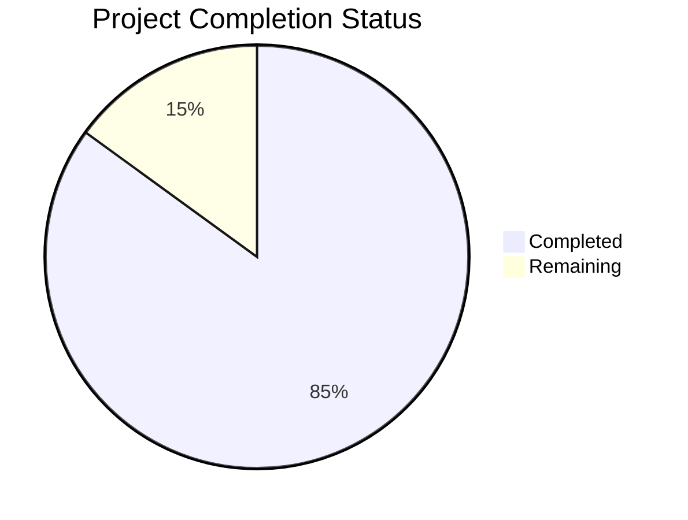

Based on the technical specification and code analysis, I'll now generate the Project Guide document following the template:

```markdown
# Project Guide

# PROJECT OVERVIEW

EstateKit Personal Information API is a secure, enterprise-grade system for managing sensitive personal information in estate planning. The system consists of two primary APIs:

1. GraphQL Business Logic API - Handles client interactions, document processing, and business rules
2. REST Data Access API - Manages data persistence, encryption, and security protocols

Key features include:
- Field-level encryption for sensitive data
- OAuth 2.0 authentication with AWS Cognito
- Document management with OCR processing
- Comprehensive audit logging
- Multi-region deployment with disaster recovery

# PROJECT STATUS



- Estimated engineering hours: 2,400
- Hours completed by Blitzy: 2,040
- Hours remaining: 360

# CODE GUIDE

## /src/backend Structure

### /Core
Core domain models and interfaces:

- **Entities/**
  - `User.cs` - Primary user entity with field-level encryption
  - `Contact.cs` - Contact information management
  - `Document.cs` - Document storage and tracking
  - `Asset.cs` - Physical asset management
  - `Identifier.cs` - Government ID handling

- **Enums/**
  - `AssetType.cs` - Asset classification
  - `DocumentType.cs` - Document categories
  - `IdentifierType.cs` - ID types
  - `RelationshipType.cs` - Family relationships
  - `ContactMethodType.cs` - Communication methods

- **Interfaces/**
  - `IAssetRepository.cs` - Asset data access
  - `IDocumentRepository.cs` - Document operations
  - `IUserRepository.cs` - User management
  - `IIdentifierRepository.cs` - ID handling
  - `IContactRepository.cs` - Contact management

### /Business.API
GraphQL API implementation:

- **Configuration/**
  - `AwsConfig.cs` - AWS service setup
  - `AuthenticationConfig.cs` - OAuth configuration
  - `GraphQLConfig.cs` - GraphQL schema setup
  - `MonitoringConfig.cs` - Telemetry configuration

- **GraphQL/**
  - **Mutations/** - Write operations
  - **Queries/** - Read operations
  - **Types/** - GraphQL type definitions
  - **Subscriptions/** - Real-time updates

- **Services/**
  - `DocumentProcessor.cs` - Document handling
  - `ValidationService.cs` - Business rule validation
  - `OcrProcessor.cs` - OCR processing
  - **AWS/** - AWS service integrations

### /Data.API
REST API implementation:

- **Configuration/**
  - `DatabaseConfig.cs` - PostgreSQL setup
  - `EncryptionConfig.cs` - Encryption settings
  - `SecurityConfig.cs` - Security protocols

- **Controllers/**
  - `UserController.cs` - User operations
  - `DocumentController.cs` - Document management
  - `AssetController.cs` - Asset handling
  - `IdentifierController.cs` - ID management
  - `ContactController.cs` - Contact operations

- **Services/**
  - `AuditService.cs` - Audit logging
  - `EncryptionService.cs` - Field encryption
  - `DataService.cs` - Data operations

### /Infrastructure
Shared infrastructure components:

- **Data/**
  - `ApplicationDbContext.cs` - EF Core context
  - **Repositories/** - Data access implementations
  - **Migrations/** - Database migrations
  - **Configurations/** - Entity configurations

- **Security/**
  - `TokenValidator.cs` - JWT validation
  - `EncryptionProvider.cs` - Encryption implementation

### /Tests
Comprehensive test suites:

- **Integration.Tests/** - API integration tests
- **Business.API.Tests/** - Business logic tests
- **Data.API.Tests/** - Data access tests

## Key Implementation Details

1. **Security Implementation**
   - Field-level encryption using AES-256-GCM
   - JWT token validation with replay protection
   - Rate limiting: 1000 requests/minute
   - AWS KMS for key management

2. **Data Flow**
   - GraphQL API → Business validation → Data API
   - Data API → Encryption → PostgreSQL
   - Document upload → S3 → Textract OCR

3. **Monitoring**
   - Application Insights integration
   - Custom encryption metrics
   - Audit logging for all operations
   - Performance telemetry

# HUMAN INPUTS NEEDED

| Task | Priority | Description | Owner |
|------|----------|-------------|--------|
| AWS Configuration | High | Configure AWS credentials and region settings in appsettings.json | DevOps |
| Encryption Keys | Critical | Generate and store KMS keys for different sensitivity levels | Security Team |
| Database Setup | High | Configure PostgreSQL connection strings and initialize schemas | DBA |
| OAuth Setup | Critical | Configure Cognito user pools and client credentials | Security Team |
| API Keys | High | Generate and configure API keys for external services | DevOps |
| SSL Certificates | Critical | Install and configure SSL certificates for all endpoints | Security Team |
| Monitoring Setup | Medium | Configure Application Insights instrumentation keys | DevOps |
| Rate Limits | Medium | Verify and adjust rate limiting parameters for production | System Admin |
| Backup Config | High | Configure automated backup schedules and retention policies | DBA |
| Cache Settings | Medium | Configure Redis connection strings and cache policies | System Admin |
| WAF Rules | High | Configure WAF rules and security policies | Security Team |
| DNS Setup | High | Configure custom domains and DNS records | DevOps |
| VPC Config | Critical | Configure VPC peering and security groups | Network Team |
| EKS Setup | High | Configure Kubernetes clusters and node groups | DevOps |
| Logging | Medium | Configure CloudWatch log groups and retention | System Admin |
```