# Technical Specifications

# 1. INTRODUCTION

## 1.1 EXECUTIVE SUMMARY

The EstateKit Personal Information API system comprises two interconnected APIs designed to securely manage and process sensitive personal information for estate planning purposes. The system addresses the critical need for secure, compliant handling of personal data through a GraphQL business logic API and a REST-based data access API. This solution enables front-facing applications to safely store and retrieve personal information while maintaining strict security protocols and regulatory compliance.

The system serves web and mobile application developers while providing enterprise-grade security features including field-level encryption, OAuth authentication, and comprehensive audit logging. By separating business logic from data access, the architecture ensures optimal security, maintainability, and scalability.

## 1.2 SYSTEM OVERVIEW

### Project Context

| Aspect | Description |
|--------|-------------|
| Business Context | Part of the larger EstateKit ecosystem providing personal information management services |
| Current Limitations | Need for secure, centralized personal data management with field-level encryption |
| Enterprise Integration | Interfaces with EstateKit encryption service, security provider, and document storage systems |

### High-Level Description

The system consists of two primary components:

1. GraphQL Business Logic API
- Handles all client interactions
- Processes document uploads and OCR
- Manages business rules and validation
- Integrates with AWS services

2. REST Data Access API
- Provides exclusive database access
- Manages data encryption/decryption
- Enforces security protocols
- Handles data persistence

### Success Criteria

| Category | Metrics |
|----------|---------|
| Performance | - Response time < 3 seconds<br>- 99.9% uptime<br>- Support for 1000 concurrent users |
| Security | - Zero data breaches<br>- 100% sensitive field encryption<br>- Complete audit trail coverage |
| Reliability | - < 0.1% error rate<br>- 100% data consistency<br>- Zero data loss incidents |

## 1.3 SCOPE

### In-Scope Elements

#### Core Features

| Feature Category | Components |
|-----------------|------------|
| Personal Information Management | - Basic personal details<br>- Government IDs<br>- Contact information<br>- Family relationships |
| Document Processing | - Document upload/storage<br>- OCR processing<br>- Version control |
| Security Features | - Field-level encryption<br>- OAuth authentication<br>- Audit logging |
| Data Access | - CRUD operations<br>- Batch processing<br>- Data validation |

#### Implementation Boundaries

| Boundary Type | Coverage |
|--------------|----------|
| System Integration | - AWS services<br>- EstateKit ecosystem<br>- OAuth provider |
| User Groups | - Web application users<br>- Mobile application users<br>- System administrators |
| Data Domains | - Personal information<br>- Government IDs<br>- Documents<br>- Relationships |

### Out-of-Scope Elements

- Direct database access from applications
- User interface components
- Authentication provider implementation
- Payment processing
- Third-party integrations not specified
- Legacy system migrations
- Mobile application development
- Custom reporting tools
- Data analytics and business intelligence
- User notification systems

# 2. SYSTEM ARCHITECTURE

## 2.1 High-Level Architecture

The EstateKit Personal Information API system follows a distributed architecture pattern with two primary services communicating through well-defined interfaces.

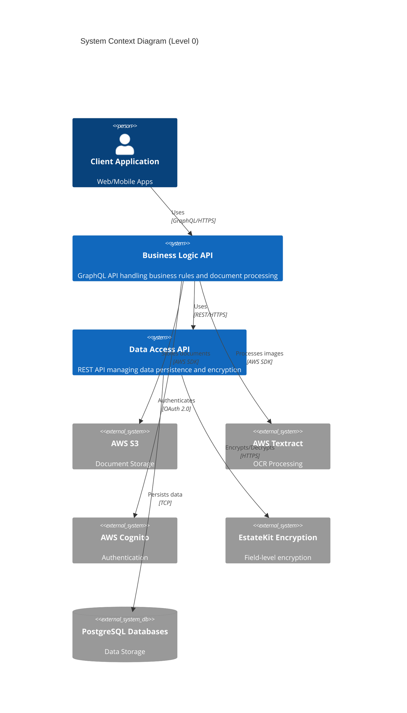
```mermaid
C4Context
    title System Context Diagram (Level 0)
    
    Person(client, "Client Application", "Web/Mobile Apps")
    System(businessAPI, "Business Logic API", "GraphQL API handling business rules and document processing")
    System(dataAPI, "Data Access API", "REST API managing data persistence and encryption")
    System_Ext(s3, "AWS S3", "Document Storage")
    System_Ext(textract, "AWS Textract", "OCR Processing")
    System_Ext(cognito, "AWS Cognito", "Authentication")
    System_Ext(encryption, "EstateKit Encryption", "Field-level encryption")
    SystemDb_Ext(db, "PostgreSQL Databases", "Data Storage")
    
    Rel(client, businessAPI, "Uses", "GraphQL/HTTPS")
    Rel(businessAPI, dataAPI, "Uses", "REST/HTTPS")
    Rel(businessAPI, s3, "Stores documents", "AWS SDK")
    Rel(businessAPI, textract, "Processes images", "AWS SDK")
    Rel(businessAPI, cognito, "Authenticates", "OAuth 2.0")
    Rel(dataAPI, encryption, "Encrypts/Decrypts", "HTTPS")
    Rel(dataAPI, db, "Persists data", "TCP")
```

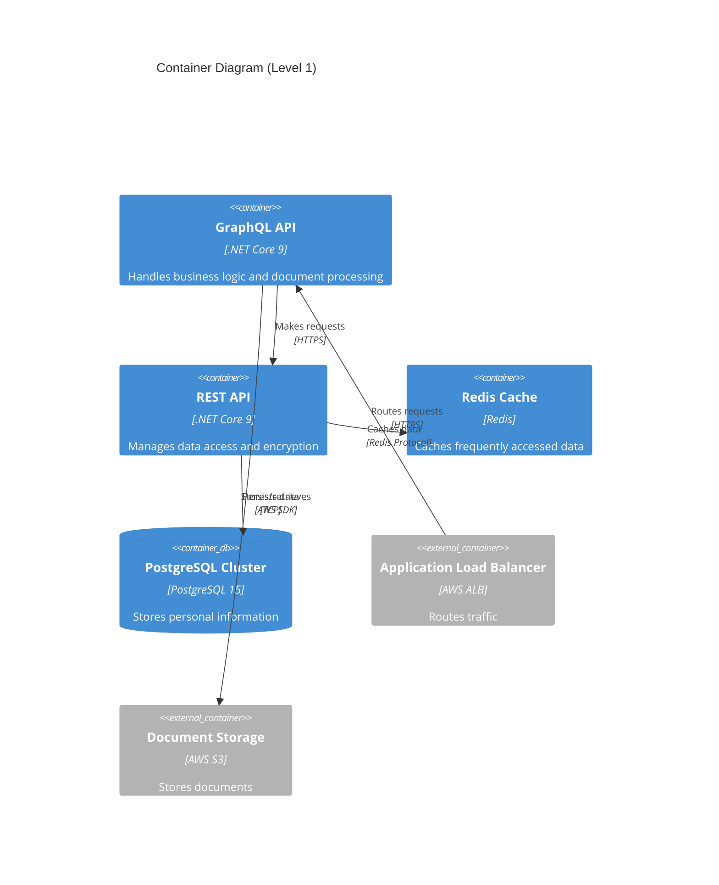
```mermaid
C4Container
    title Container Diagram (Level 1)
    
    Container(graphql, "GraphQL API", ".NET Core 9", "Handles business logic and document processing")
    Container(rest, "REST API", ".NET Core 9", "Manages data access and encryption")
    Container(cache, "Redis Cache", "Redis", "Caches frequently accessed data")
    
    ContainerDb(postgres, "PostgreSQL Cluster", "PostgreSQL 15", "Stores personal information")
    
    Container_Ext(alb, "Application Load Balancer", "AWS ALB", "Routes traffic")
    Container_Ext(s3, "Document Storage", "AWS S3", "Stores documents")
    
    Rel(alb, graphql, "Routes requests", "HTTPS")
    Rel(graphql, rest, "Makes requests", "HTTPS")
    Rel(graphql, s3, "Stores/retrieves", "AWS SDK")
    Rel(rest, cache, "Caches data", "Redis Protocol")
    Rel(rest, postgres, "Persists data", "TCP")
```

## 2.2 Component Details

### 2.2.1 Business Logic API Components

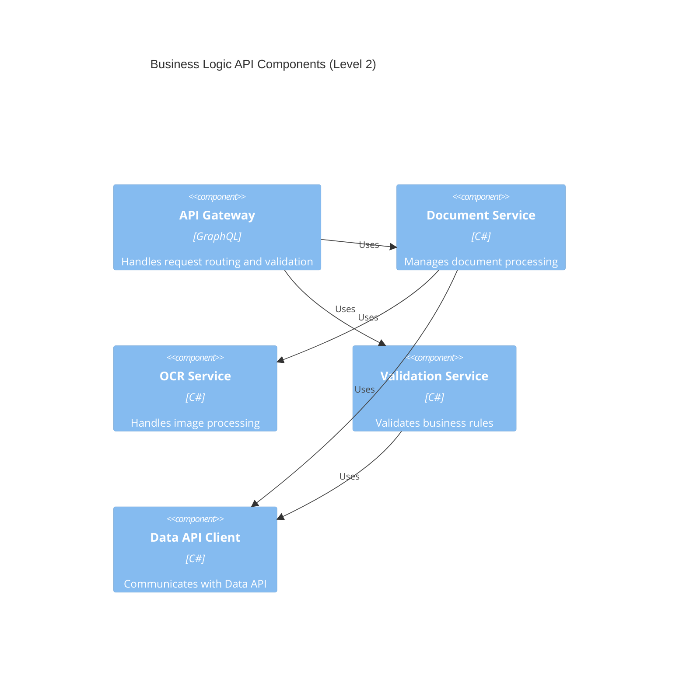
```mermaid
C4Component
    title Business Logic API Components (Level 2)
    
    Component(gateway, "API Gateway", "GraphQL", "Handles request routing and validation")
    Component(doc, "Document Service", "C#", "Manages document processing")
    Component(ocr, "OCR Service", "C#", "Handles image processing")
    Component(validation, "Validation Service", "C#", "Validates business rules")
    Component(client, "Data API Client", "C#", "Communicates with Data API")
    
    Rel(gateway, doc, "Uses")
    Rel(gateway, validation, "Uses")
    Rel(doc, ocr, "Uses")
    Rel(doc, client, "Uses")
    Rel(validation, client, "Uses")
```

### 2.2.2 Data Access API Components

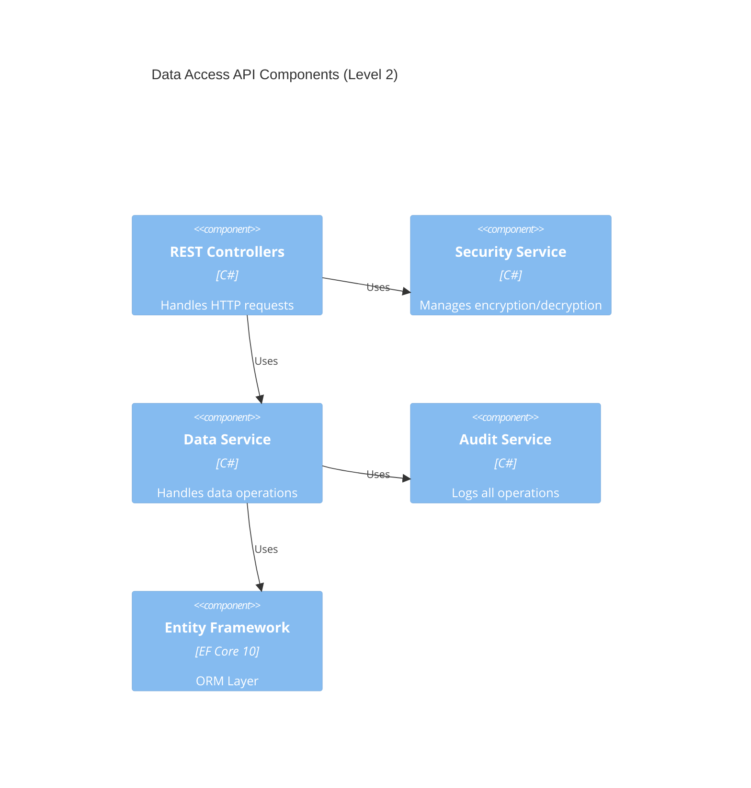
```mermaid
C4Component
    title Data Access API Components (Level 2)
    
    Component(controller, "REST Controllers", "C#", "Handles HTTP requests")
    Component(security, "Security Service", "C#", "Manages encryption/decryption")
    Component(data, "Data Service", "C#", "Handles data operations")
    Component(audit, "Audit Service", "C#", "Logs all operations")
    Component(ef, "Entity Framework", "EF Core 10", "ORM Layer")
    
    Rel(controller, security, "Uses")
    Rel(controller, data, "Uses")
    Rel(data, ef, "Uses")
    Rel(data, audit, "Uses")
```

## 2.3 Technical Decisions

### 2.3.1 Data Flow Architecture

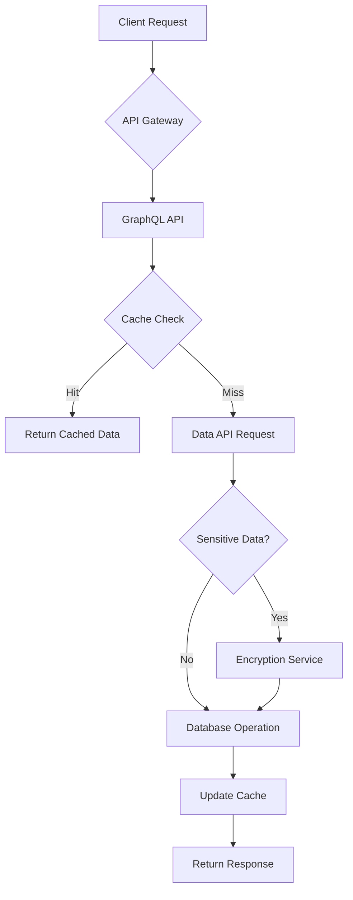
```mermaid
flowchart TD
    A[Client Request] --> B{API Gateway}
    B --> C[GraphQL API]
    C --> D{Cache Check}
    D -->|Hit| E[Return Cached Data]
    D -->|Miss| F[Data API Request]
    F --> G{Sensitive Data?}
    G -->|Yes| H[Encryption Service]
    G -->|No| I[Database Operation]
    H --> I
    I --> J[Update Cache]
    J --> K[Return Response]
```

### 2.3.2 Deployment Architecture

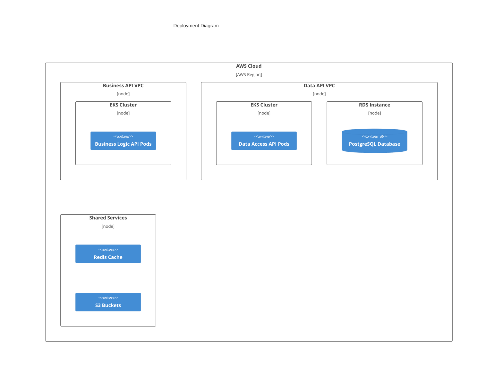
```mermaid
C4Deployment
    title Deployment Diagram
    
    Deployment_Node(aws, "AWS Cloud", "AWS Region") {
        Deployment_Node(vpc1, "Business API VPC") {
            Deployment_Node(eks1, "EKS Cluster") {
                Container(api1, "Business Logic API Pods")
            }
        }
        
        Deployment_Node(vpc2, "Data API VPC") {
            Deployment_Node(eks2, "EKS Cluster") {
                Container(api2, "Data Access API Pods")
            }
            Deployment_Node(rds, "RDS Instance") {
                ContainerDb(db, "PostgreSQL Database")
            }
        }
        
        Deployment_Node(shared, "Shared Services") {
            Container(redis, "Redis Cache")
            Container(s3, "S3 Buckets")
        }
    }
```

## 2.4 Cross-Cutting Concerns

### 2.4.1 Monitoring and Observability

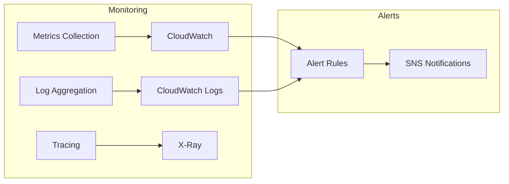
```mermaid
flowchart LR
    subgraph Monitoring
        A[Metrics Collection] --> B[CloudWatch]
        C[Log Aggregation] --> D[CloudWatch Logs]
        E[Tracing] --> F[X-Ray]
    end
    
    subgraph Alerts
        B --> G[Alert Rules]
        D --> G
        G --> H[SNS Notifications]
    end
```

### 2.4.2 Security Architecture

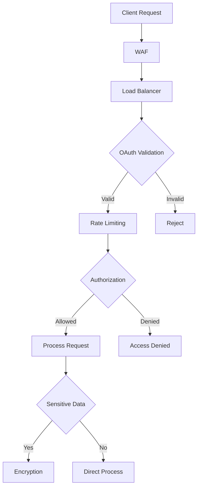
```mermaid
flowchart TD
    A[Client Request] --> B[WAF]
    B --> C[Load Balancer]
    C --> D{OAuth Validation}
    D -->|Valid| E[Rate Limiting]
    D -->|Invalid| F[Reject]
    E --> G{Authorization}
    G -->|Allowed| H[Process Request]
    G -->|Denied| I[Access Denied]
    H --> J{Sensitive Data}
    J -->|Yes| K[Encryption]
    J -->|No| L[Direct Process]
```

## 2.5 Infrastructure Components

| Component | Technology | Purpose | Scaling Strategy |
|-----------|------------|---------|------------------|
| Business API | EKS Pods | Business Logic Processing | Horizontal pod autoscaling |
| Data API | EKS Pods | Data Access Management | Horizontal pod autoscaling |
| Cache | Redis Cluster | Performance Optimization | Memory scaling |
| Database | PostgreSQL RDS | Data Persistence | Vertical + Read replicas |
| Document Storage | S3 | Document Management | Automatic |
| Load Balancer | AWS ALB | Traffic Distribution | Automatic |

## 2.6 Security Zones

| Zone | Components | Access Controls | Network Rules |
|------|------------|----------------|---------------|
| Public | Load Balancers | WAF, SSL/TLS | Inbound 443 only |
| Business | Business API | OAuth, JWT | VPC restricted |
| Data | Data API | OAuth, JWT | Private subnet |
| Storage | Databases, S3 | IAM, KMS | No public access |

# 3. SYSTEM COMPONENTS ARCHITECTURE

## 3.1 API DESIGN

### 3.1.1 API Architecture

| Component | Specification | Details |
|-----------|--------------|---------|
| GraphQL Protocol | HTTP/1.1, HTTP/2 | - TLS 1.3 required<br>- WebSocket support for subscriptions<br>- Compression enabled |
| REST Protocol | HTTP/1.1 | - TLS 1.3 required<br>- JSON payload format<br>- Compression for responses >1KB |
| Authentication | OAuth 2.0 with JWT | - AWS Cognito integration<br>- Token expiration: 1 hour<br>- Refresh token: 30 days |
| Rate Limiting | Token bucket | - 1000 requests/minute per client<br>- Burst: 2000 requests<br>- 429 status for exceeded limits |
| Versioning | Date-based | - GraphQL: Schema versioning<br>- REST: URI versioning (v1, v2)<br>- Deprecation notices: 6 months |

### 3.1.2 GraphQL API Specifications

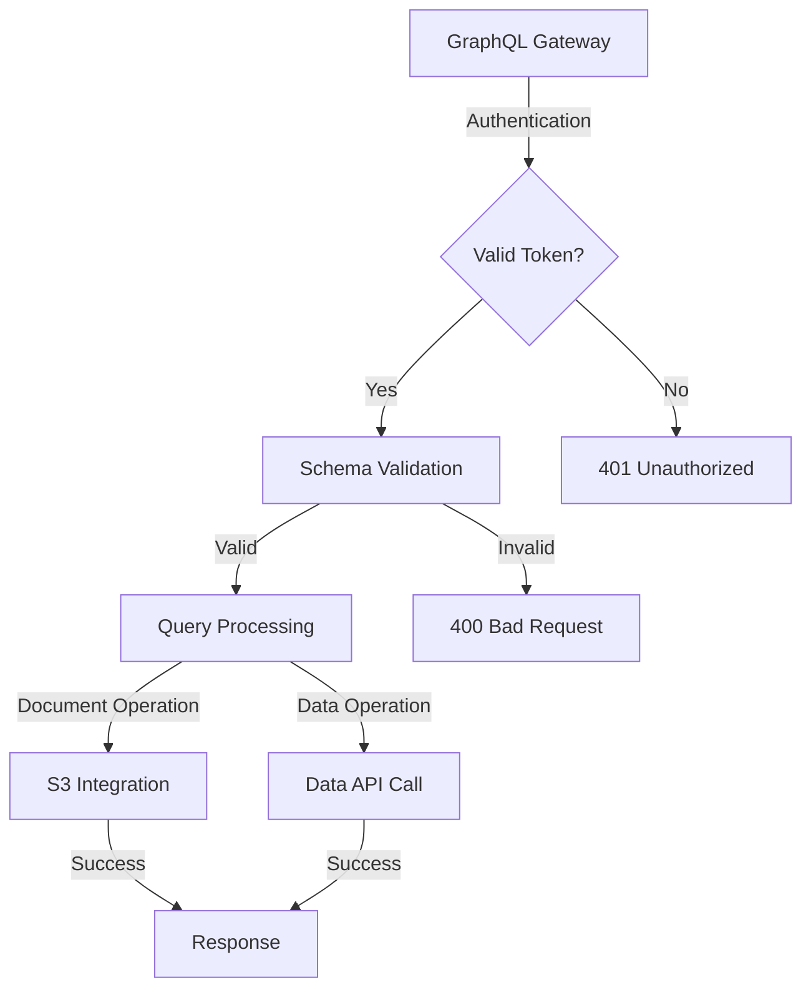
```mermaid
graph TD
    A[GraphQL Gateway] -->|Authentication| B{Valid Token?}
    B -->|Yes| C[Schema Validation]
    B -->|No| D[401 Unauthorized]
    C -->|Valid| E[Query Processing]
    C -->|Invalid| F[400 Bad Request]
    E -->|Document Operation| G[S3 Integration]
    E -->|Data Operation| H[Data API Call]
    G -->|Success| I[Response]
    H -->|Success| I
```

#### Query Structure

```graphql
type User {
  id: ID!
  contact: Contact!
  documents: [Document!]!
  assets: [Asset!]!
  civilServices: [CivilService!]!
  denominations: [Denomination!]!
}

type Contact {
  id: ID!
  firstName: String!
  lastName: String!
  middleName: String
  maidenName: String
  addresses: [Address!]!
  citizenships: [Citizenship!]!
  companies: [Company!]!
  contactMethods: [ContactMethod!]!
  relationships: [Relationship!]!
}
```

### 3.1.3 REST API Specifications

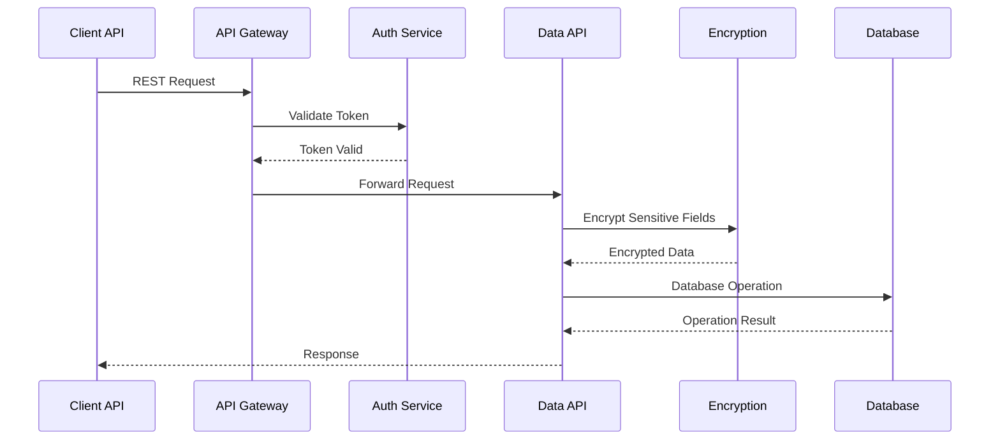
```mermaid
sequenceDiagram
    participant C as Client API
    participant G as API Gateway
    participant A as Auth Service
    participant D as Data API
    participant E as Encryption
    participant DB as Database

    C->>G: REST Request
    G->>A: Validate Token
    A-->>G: Token Valid
    G->>D: Forward Request
    D->>E: Encrypt Sensitive Fields
    E-->>D: Encrypted Data
    D->>DB: Database Operation
    DB-->>D: Operation Result
    D-->>C: Response
```

#### Endpoint Structure

| Endpoint | Method | Purpose | Rate Limit |
|----------|--------|---------|------------|
| /v1/users/{id} | GET | Retrieve user data | 1000/min |
| /v1/users/{id}/documents | POST | Upload document | 100/min |
| /v1/users/{id}/identifiers | PUT | Update IDs | 500/min |
| /v1/users/{id}/relationships | GET | Get relationships | 1000/min |

### 3.1.4 Integration Requirements

| System | Integration Method | Requirements |
|--------|-------------------|--------------|
| AWS S3 | SDK | - Direct upload for documents<br>- Presigned URLs for downloads<br>- Server-side encryption |
| AWS Textract | Async API | - Batch processing support<br>- Result polling<br>- Error handling |
| Encryption Service | REST | - Synchronous encryption<br>- Key rotation support<br>- High availability |

## 3.2 DATABASE DESIGN

### 3.2.1 Schema Design

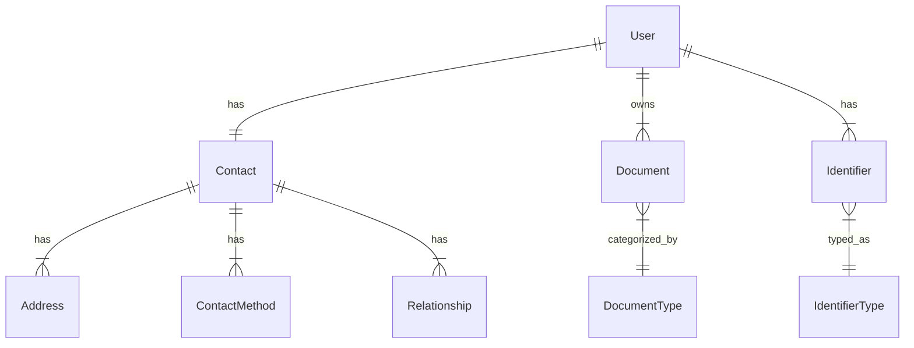
```mermaid
erDiagram
    User ||--|| Contact : has
    Contact ||--|{ Address : has
    Contact ||--|{ ContactMethod : has
    Contact ||--|{ Relationship : has
    User ||--|{ Document : owns
    Document }|--|| DocumentType : categorized_by
    User ||--|{ Identifier : has
    Identifier }|--|| IdentifierType : typed_as
```

### 3.2.2 Table Structures

| Table | Partitioning Strategy | Indexes |
|-------|----------------------|---------|
| user | Hash(id) | - Primary: id<br>- Secondary: contact_id |
| contact | Hash(id) | - Primary: id<br>- Secondary: last_name, email |
| document | Range(created_date) | - Primary: id<br>- Secondary: user_id, type |
| identifier | Hash(user_id) | - Primary: id<br>- Secondary: type, value |

### 3.2.3 Data Management

| Aspect | Strategy | Details |
|--------|----------|---------|
| Migrations | Forward-only | - Versioned migrations<br>- Blue-green deployment<br>- Rollback procedures |
| Archival | Time-based | - 7-year retention<br>- Glacier storage<br>- Encrypted archives |
| Auditing | Change Data Capture | - All CRUD operations<br>- User tracking<br>- Timestamp logging |

### 3.2.4 Performance Optimization

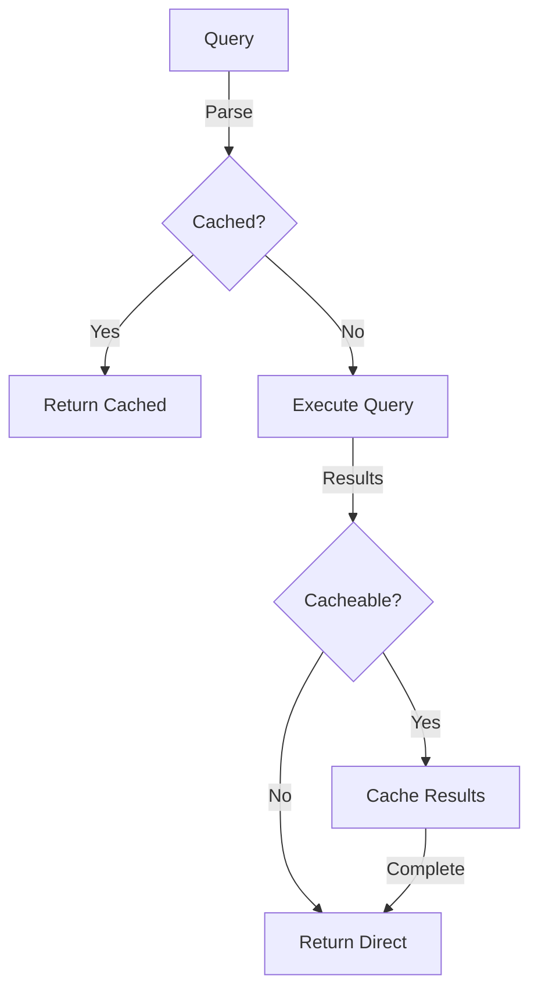
```mermaid
flowchart TD
    A[Query] -->|Parse| B{Cached?}
    B -->|Yes| C[Return Cached]
    B -->|No| D[Execute Query]
    D -->|Results| E{Cacheable?}
    E -->|Yes| F[Cache Results]
    E -->|No| G[Return Direct]
    F -->|Complete| G
```

| Strategy | Implementation | Metrics |
|----------|----------------|---------|
| Caching | Redis | - 5-minute TTL<br>- 10GB cache size<br>- LRU eviction |
| Indexing | B-tree/Hash | - Covering indexes<br>- Partial indexes<br>- Index-only scans |
| Partitioning | Range/Hash | - Monthly partitions<br>- User-based sharding<br>- Archive partitions |

## 3.3 SECURITY DESIGN

### 3.3.1 Authentication Flow

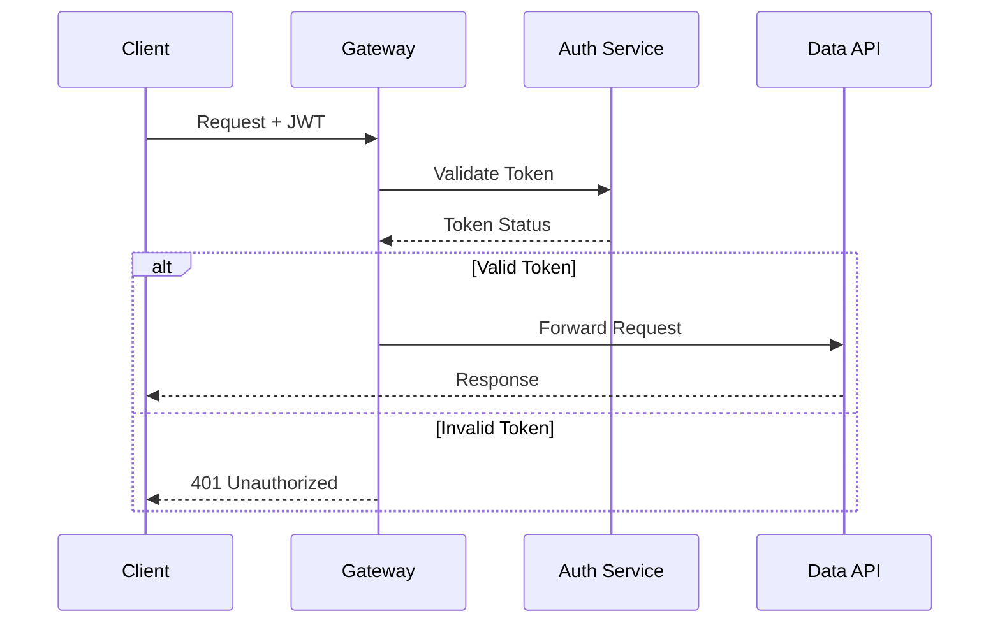
```mermaid
sequenceDiagram
    participant C as Client
    participant G as Gateway
    participant A as Auth Service
    participant D as Data API

    C->>G: Request + JWT
    G->>A: Validate Token
    A-->>G: Token Status
    alt Valid Token
        G->>D: Forward Request
        D-->>C: Response
    else Invalid Token
        G-->>C: 401 Unauthorized
    end
```

### 3.3.2 Encryption Strategy

| Data Type | Encryption Method | Key Management |
|-----------|------------------|----------------|
| PII | Field-level | - Per-user keys<br>- Daily rotation<br>- HSM storage |
| Documents | Envelope | - S3 server-side<br>- CMK in KMS<br>- Yearly rotation |
| Credentials | Hash+Salt | - Argon2 algorithm<br>- Random salt<br>- Work factor: 12 |

### 3.3.3 Access Control

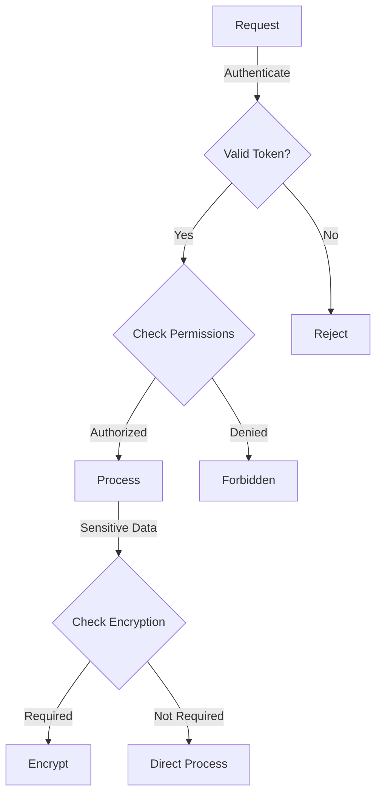
```mermaid
flowchart TD
    A[Request] -->|Authenticate| B{Valid Token?}
    B -->|Yes| C{Check Permissions}
    B -->|No| D[Reject]
    C -->|Authorized| E[Process]
    C -->|Denied| F[Forbidden]
    E -->|Sensitive Data| G{Check Encryption}
    G -->|Required| H[Encrypt]
    G -->|Not Required| I[Direct Process]
```

# 4. TECHNOLOGY STACK

## 4.1 PROGRAMMING LANGUAGES

| Component | Language | Version | Justification |
|-----------|----------|---------|---------------|
| Business Logic API | C# | 12.0 | - Native .NET Core 9 support<br>- Strong typing for GraphQL schema<br>- Excellent AWS SDK integration |
| Data Access API | C# | 12.0 | - Entity Framework Core compatibility<br>- High-performance PostgreSQL drivers<br>- Advanced async/await patterns |
| Infrastructure Code | TypeScript | 5.0 | - Type-safe AWS CDK implementation<br>- Enhanced developer productivity<br>- Strong IDE support |
| Database Scripts | SQL | ANSI SQL:2016 | - PostgreSQL compatibility<br>- Complex query optimization<br>- Stored procedure support |

## 4.2 FRAMEWORKS & LIBRARIES

### 4.2.1 Core Frameworks

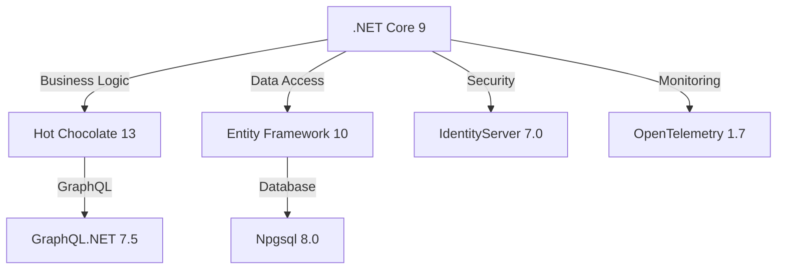
```mermaid
graph TD
    A[.NET Core 9] -->|Business Logic| B[Hot Chocolate 13]
    A -->|Data Access| C[Entity Framework 10]
    B -->|GraphQL| D[GraphQL.NET 7.5]
    C -->|Database| E[Npgsql 8.0]
    A -->|Security| F[IdentityServer 7.0]
    A -->|Monitoring| G[OpenTelemetry 1.7]
```

| Framework | Version | Purpose | Justification |
|-----------|---------|---------|---------------|
| .NET Core | 9.0 | Application Platform | - Enterprise-grade performance<br>- Comprehensive ecosystem<br>- AWS integration |
| Hot Chocolate | 13.0 | GraphQL Server | - Native .NET integration<br>- Schema-first development<br>- Subscription support |
| Entity Framework Core | 10.0 | ORM | - PostgreSQL optimization<br>- LINQ support<br>- Migration management |
| AWS SDK for .NET | 3.7 | AWS Integration | - S3 and Textract integration<br>- Native async support<br>- Comprehensive AWS coverage |

### 4.2.2 Supporting Libraries

| Category | Library | Version | Purpose |
|----------|---------|---------|---------|
| Logging | Serilog | 3.1 | Structured logging |
| Caching | StackExchange.Redis | 2.6 | Distributed caching |
| Security | BouncyCastle.NET | 2.2 | Cryptography operations |
| Validation | FluentValidation | 11.0 | Business rule validation |
| Testing | xUnit | 2.5 | Unit testing framework |
| Mocking | Moq | 4.18 | Test mocking framework |

## 4.3 DATABASES & STORAGE

### 4.3.1 Database Architecture

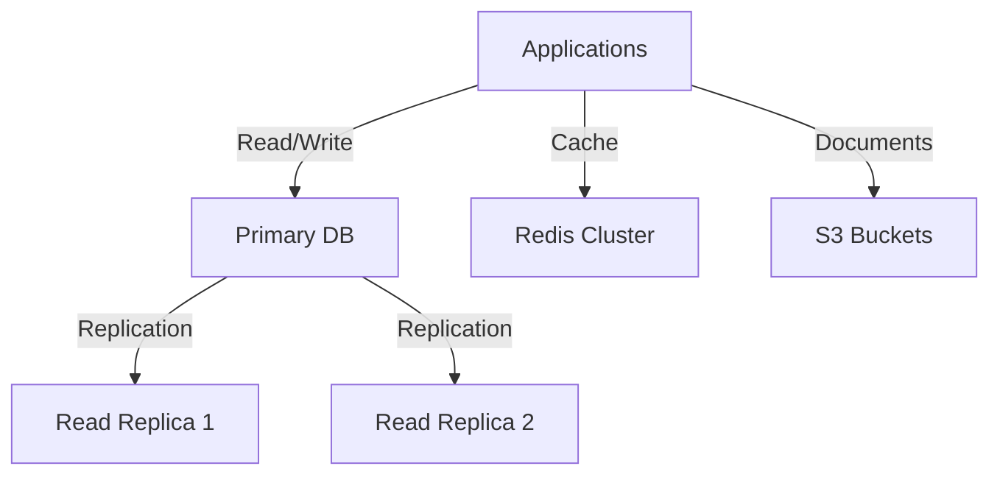
```mermaid
graph TD
    A[Applications] -->|Read/Write| B[Primary DB]
    B -->|Replication| C[Read Replica 1]
    B -->|Replication| D[Read Replica 2]
    A -->|Cache| E[Redis Cluster]
    A -->|Documents| F[S3 Buckets]
```

| Component | Technology | Version | Configuration |
|-----------|------------|---------|---------------|
| Primary Database | PostgreSQL | 15.0 | - Multi-AZ deployment<br>- PIOPS storage<br>- WAL archiving |
| Read Replicas | PostgreSQL | 15.0 | - Cross-AZ distribution<br>- Automated failover<br>- Read scaling |
| Cache Layer | Redis | 7.0 | - Cluster mode enabled<br>- Multi-AZ deployment<br>- Encryption at rest |
| Document Storage | AWS S3 | N/A | - Versioning enabled<br>- Server-side encryption<br>- Lifecycle policies |

## 4.4 THIRD-PARTY SERVICES

### 4.4.1 AWS Services

| Service | Purpose | Configuration |
|---------|---------|---------------|
| EKS | Container Orchestration | - Managed node groups<br>- Multi-AZ deployment<br>- Cluster autoscaling |
| Cognito | Authentication | - OAuth 2.0 flows<br>- JWT token issuance<br>- MFA support |
| Textract | OCR Processing | - Async operation mode<br>- Custom vocabulary<br>- Confidence thresholds |
| CloudWatch | Monitoring | - Custom metrics<br>- Log aggregation<br>- Alarm configuration |

### 4.4.2 External Services Integration

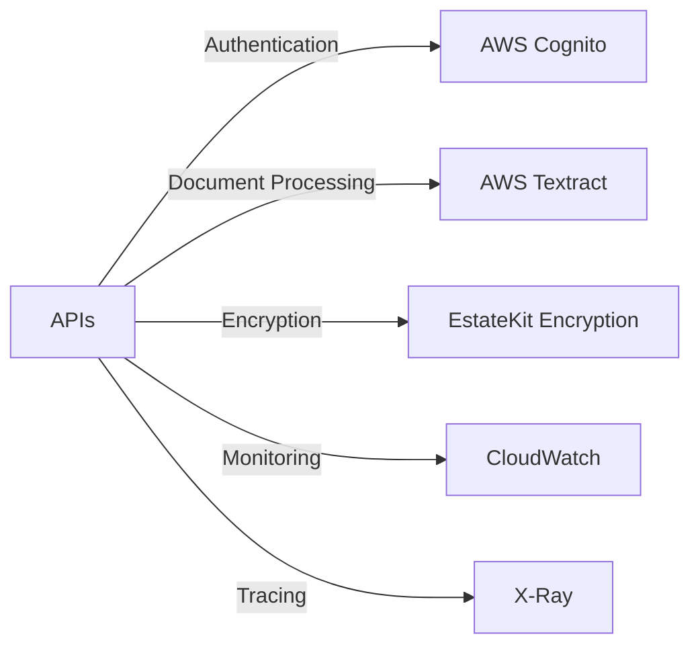
```mermaid
graph LR
    A[APIs] -->|Authentication| B[AWS Cognito]
    A -->|Document Processing| C[AWS Textract]
    A -->|Encryption| D[EstateKit Encryption]
    A -->|Monitoring| E[CloudWatch]
    A -->|Tracing| F[X-Ray]
```

## 4.5 DEVELOPMENT & DEPLOYMENT

### 4.5.1 Development Tools

| Category | Tool | Version | Purpose |
|----------|------|---------|---------|
| IDE | Visual Studio | 2024 | Primary development |
| API Testing | Postman | 10.0 | API verification |
| Version Control | Git | 2.40 | Source control |
| Package Management | NuGet | 6.0 | Dependency management |

### 4.5.2 CI/CD Pipeline

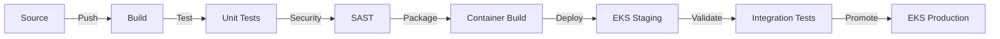
```mermaid
graph LR
    A[Source] -->|Push| B[Build]
    B -->|Test| C[Unit Tests]
    C -->|Security| D[SAST]
    D -->|Package| E[Container Build]
    E -->|Deploy| F[EKS Staging]
    F -->|Validate| G[Integration Tests]
    G -->|Promote| H[EKS Production]
```

| Stage | Tools | Configuration |
|-------|-------|---------------|
| Build | Azure DevOps | - .NET build agents<br>- Dependency scanning<br>- Code coverage |
| Test | xUnit/Postman | - Automated test suites<br>- Integration tests<br>- Performance tests |
| Security | SonarQube | - Code analysis<br>- Vulnerability scanning<br>- Compliance checks |
| Deployment | Helm | - Kubernetes manifests<br>- Rolling updates<br>- Canary deployments |

# 5. SYSTEM DESIGN

## 5.1 API DESIGN

### 5.1.1 GraphQL Business Logic API

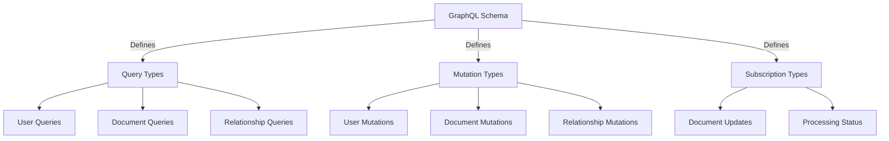
```mermaid
graph TD
    A[GraphQL Schema] -->|Defines| B[Query Types]
    A -->|Defines| C[Mutation Types]
    A -->|Defines| D[Subscription Types]
    
    B --> E[User Queries]
    B --> F[Document Queries]
    B --> G[Relationship Queries]
    
    C --> H[User Mutations]
    C --> I[Document Mutations]
    C --> J[Relationship Mutations]
    
    D --> K[Document Updates]
    D --> L[Processing Status]
```

#### Core Schema Types

```graphql
type User {
  id: ID!
  contact: Contact!
  dateOfBirth: String! @sensitive
  birthPlace: Address
  maritalStatus: MaritalStatus!
  documents: [Document!]!
  identifiers: [Identifier!]!
  relationships: [Relationship!]!
  denominations: [Denomination!]!
  civilServices: [CivilService!]!
  assets: [Asset!]!
}

type Contact {
  firstName: String!
  lastName: String!
  middleName: String
  maidenName: String
  addresses: [Address!]!
  contactMethods: [ContactMethod!]!
}

type Document @aws_auth(cognito_groups: ["admin", "user"]) {
  id: ID!
  type: DocumentType!
  frontImageUrl: String
  backImageUrl: String
  location: String
  inKit: Boolean!
  metadata: JSON
  createdAt: DateTime!
  updatedAt: DateTime
}
```

### 5.1.2 REST Data Access API

| Endpoint | Method | Description | Authentication |
|----------|--------|-------------|----------------|
| `/api/v1/users/{id}` | GET | Retrieve user data | OAuth2 |
| `/api/v1/users/{id}/documents` | GET | List user documents | OAuth2 |
| `/api/v1/users/{id}/identifiers` | GET | Get user identifiers | OAuth2 |
| `/api/v1/documents/{id}` | POST | Create document | OAuth2 |
| `/api/v1/documents/{id}/process` | POST | Process document OCR | OAuth2 |

#### Request/Response Flow

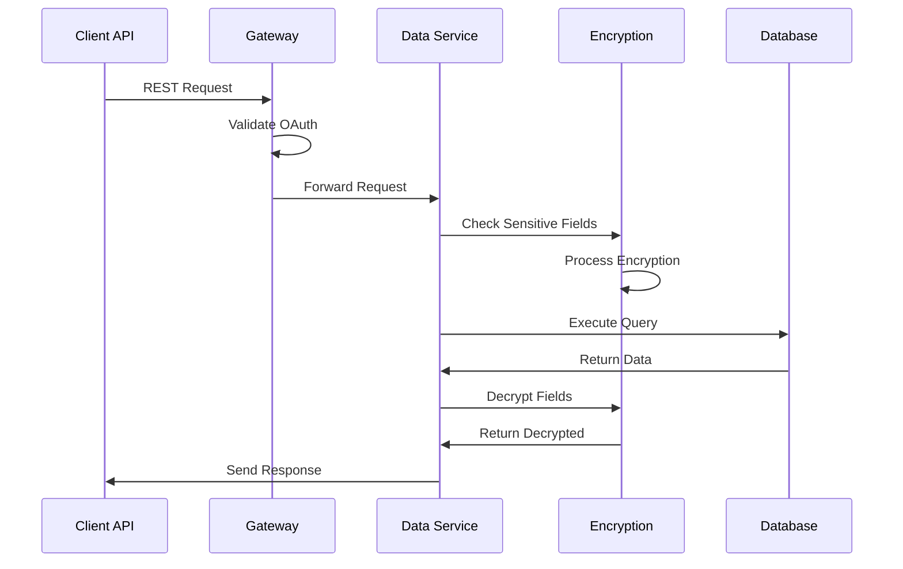
```mermaid
sequenceDiagram
    participant C as Client API
    participant G as Gateway
    participant D as Data Service
    participant E as Encryption
    participant DB as Database

    C->>G: REST Request
    G->>G: Validate OAuth
    G->>D: Forward Request
    D->>E: Check Sensitive Fields
    E->>E: Process Encryption
    D->>DB: Execute Query
    DB->>D: Return Data
    D->>E: Decrypt Fields
    E->>D: Return Decrypted
    D->>C: Send Response
```

## 5.2 DATABASE DESIGN

### 5.2.1 Schema Overview

```mermaid
erDiagram
    User ||--|| Contact : has
    User ||--|{ Document : owns
    User ||--|{ Identifier : has
    User ||--|{ Asset : owns
    Contact ||--|{ Address : has
    Contact ||--|{ ContactMethod : has
    Contact ||--|{ Relationship : maintains
    Document }|--|| DocumentType : categorized
    Identifier }|--|| IdentifierType : typed
```

### 5.2.2 Table Structures

| Table | Primary Key | Indexes | Partitioning |
|-------|------------|---------|--------------|
| user | id | contact_id, created_at | Hash(id) |
| contact | id | last_name, email | Hash(id) |
| document | id | user_id, type, created_at | Range(created_at) |
| identifier | id | user_id, type | Hash(user_id) |
| relationship | id | contact_id, related_id | Hash(contact_id) |

### 5.2.3 Data Access Patterns

```mermaid
flowchart TD
    A[Query] -->|Check| B{Cached?}
    B -->|Yes| C[Return Cache]
    B -->|No| D{Sensitive Data?}
    D -->|Yes| E[Decrypt Fields]
    D -->|No| F[Direct Query]
    E --> G[Execute Query]
    F --> G
    G -->|Results| H[Cache if Eligible]
    H --> I[Return Data]
```

## 5.3 SECURITY DESIGN

### 5.3.1 Authentication Flow

```mermaid
sequenceDiagram
    participant C as Client
    participant B as Business API
    participant D as Data API
    participant A as AWS Cognito
    participant E as Encryption

    C->>A: Authenticate
    A->>C: JWT Token
    C->>B: Request + JWT
    B->>A: Validate Token
    A->>B: Token Valid
    B->>D: Data Request
    D->>E: Encrypt/Decrypt
    E->>D: Processed Data
    D->>B: Response
    B->>C: Final Response
```

### 5.3.2 Data Protection

| Layer | Protection Mechanism | Implementation |
|-------|---------------------|----------------|
| Transport | TLS 1.3 | Certificate pinning, Perfect forward secrecy |
| Application | Field-level encryption | AES-256-GCM, Key rotation |
| Storage | Database encryption | AWS RDS encryption, S3 server-side encryption |
| API | OAuth 2.0 | JWT tokens, Scope-based access |

## 5.4 SCALABILITY DESIGN

### 5.4.1 Architecture Components

```mermaid
flowchart TD
    A[Load Balancer] -->|Routes| B[Business API Cluster]
    A -->|Routes| C[Business API Cluster]
    B -->|Calls| D[Data API Cluster]
    C -->|Calls| D
    D -->|Reads| E[(Primary DB)]
    E -->|Replicates| F[(Read Replica)]
    D -->|Reads| F
    B -->|Cache| G[Redis Cluster]
    C -->|Cache| G
```

### 5.4.2 Scaling Parameters

| Component | Scaling Method | Trigger | Limits |
|-----------|---------------|---------|---------|
| Business API | Horizontal | CPU > 70% | Max 10 pods/node |
| Data API | Horizontal | Memory > 80% | Max 5 pods/node |
| Database | Vertical + Read Replicas | Connection count > 80% | 5 read replicas |
| Redis Cache | Memory | Memory > 70% | 50GB per node |

# 6. USER INTERFACE DESIGN

No user interface required. This system consists of two APIs (GraphQL Business Logic API and REST Data Access API) that provide backend services only. All user interface implementation is handled by separate frontend applications that consume these APIs.

The APIs are designed for programmatic access through:
- GraphQL queries and mutations for the Business Logic API
- REST endpoints for the Data Access API

Frontend applications should implement their own user interfaces while adhering to the data structures and security requirements defined in the API specifications.

# 7. SECURITY CONSIDERATIONS

## 7.1 AUTHENTICATION AND AUTHORIZATION

### 7.1.1 Authentication Flow

```mermaid
sequenceDiagram
    participant C as Client
    participant B as Business API
    participant D as Data API
    participant Cog as AWS Cognito
    participant E as Encryption Service

    C->>Cog: Authenticate
    Cog-->>C: JWT Token
    C->>B: Request + JWT
    B->>Cog: Validate Token
    Cog-->>B: Token Valid
    B->>D: Forward Request + JWT
    D->>Cog: Revalidate Token
    Cog-->>D: Token Valid
    D->>E: Request Encryption
    E-->>D: Process Data
    D-->>B: Response
    B-->>C: Final Response
```

### 7.1.2 Authorization Matrix

| Role | Business API Access | Data API Access | Document Access | Encryption Access |
|------|-------------------|-----------------|-----------------|------------------|
| Admin | Full access | Full access | Full access | Key management |
| Service Account | Limited endpoints | CRUD operations | Read/Write | Encrypt/Decrypt |
| Application User | GraphQL queries | No direct access | Read only | No access |
| System Monitor | Health checks | Health checks | No access | No access |

### 7.1.3 Token Management

| Aspect | Implementation | Details |
|--------|---------------|---------|
| Token Type | JWT (RS256) | - 1 hour expiration<br>- Refresh token: 30 days<br>- Signature verification |
| Claims | OAuth 2.0 | - User ID<br>- Roles/Scopes<br>- Issuer validation |
| Session | Stateless | - Token-based<br>- No server sessions<br>- Revocation through Cognito |

## 7.2 DATA SECURITY

### 7.2.1 Encryption Strategy

```mermaid
flowchart TD
    A[Data Input] -->|Check| B{Sensitive Field?}
    B -->|Yes| C[Field-Level Encryption]
    B -->|No| D[Direct Storage]
    C -->|Encrypt| E[EstateKit Encryption Service]
    E -->|Store| F[(Database)]
    D -->|Store| F
    G[Data Request] -->|Retrieve| F
    F -->|Check| H{Contains Encrypted?}
    H -->|Yes| I[Decrypt Fields]
    H -->|No| J[Return Direct]
    I -->|Decrypt| K[EstateKit Encryption Service]
    K -->|Return| L[Final Response]
    J -->|Return| L
```

### 7.2.2 Sensitive Data Classification

| Data Type | Protection Level | Encryption Method | Key Rotation |
|-----------|-----------------|-------------------|--------------|
| Government IDs | Critical | AES-256-GCM | 90 days |
| Financial Data | High | AES-256-GCM | 180 days |
| Personal Info | Medium | AES-256-CBC | 365 days |
| Documents | High | S3 SSE-KMS | 180 days |
| Access Codes | Critical | Argon2 Hash | On change |

### 7.2.3 Data Protection Measures

| Layer | Protection Mechanism | Implementation |
|-------|---------------------|----------------|
| Transport | TLS 1.3 | - Perfect forward secrecy<br>- Strong cipher suites<br>- Certificate pinning |
| Application | Field Encryption | - Per-field encryption<br>- Key separation<br>- Secure key storage |
| Storage | Database Encryption | - TDE for PostgreSQL<br>- Encrypted backups<br>- Secure key management |
| Physical | AWS Security | - Multi-AZ deployment<br>- Physical access controls<br>- Hardware security |

## 7.3 SECURITY PROTOCOLS

### 7.3.1 Network Security

```mermaid
flowchart TD
    A[Internet] -->|TLS| B[WAF]
    B -->|Filter| C[Load Balancer]
    C -->|Route| D[Business API VPC]
    D -->|Private Link| E[Data API VPC]
    E -->|Encrypted| F[Database VPC]
    D -->|Gateway| G[S3]
    D -->|Interface| H[AWS Services]
```

### 7.3.2 Security Controls

| Control Type | Implementation | Monitoring |
|-------------|----------------|------------|
| Access Control | - IP whitelisting<br>- Security groups<br>- NACL rules | CloudWatch Logs |
| Threat Detection | - WAF rules<br>- GuardDuty<br>- Security Hub | Real-time alerts |
| DDoS Protection | - Shield Advanced<br>- Rate limiting<br>- Load balancing | Performance metrics |
| Vulnerability Management | - Inspector<br>- Patch management<br>- Security scanning | Weekly reports |

### 7.3.3 Security Compliance

| Standard | Requirements | Implementation |
|----------|--------------|----------------|
| GDPR | Data protection | - Field encryption<br>- Access controls<br>- Audit logging |
| SOC 2 | Security controls | - Monitoring<br>- Access review<br>- Incident response |
| PCI DSS | Card data security | - Data isolation<br>- Encryption<br>- Access logging |
| HIPAA | Health information | - Data encryption<br>- Access controls<br>- Audit trails |

### 7.3.4 Security Monitoring

```mermaid
flowchart LR
    A[Security Events] -->|Collect| B[CloudWatch]
    B -->|Analyze| C[Security Hub]
    B -->|Alert| D[SNS]
    C -->|Report| E[Dashboard]
    C -->|Incident| F[Security Team]
    D -->|Notify| F
```

| Monitoring Type | Tools | Metrics |
|----------------|-------|---------|
| Access Monitoring | CloudTrail | - Login attempts<br>- API calls<br>- Resource access |
| Threat Detection | GuardDuty | - Suspicious activity<br>- Malicious IPs<br>- Attack patterns |
| Performance Security | CloudWatch | - Resource utilization<br>- Error rates<br>- Latency spikes |
| Compliance Monitoring | Security Hub | - Compliance status<br>- Security findings<br>- Risk scores |

# 8. INFRASTRUCTURE

## 8.1 DEPLOYMENT ENVIRONMENT

```mermaid
flowchart TD
    A[Production Environment] -->|Primary| B[AWS Cloud]
    A -->|DR| C[AWS Secondary Region]
    B -->|VPC| D[Business API Zone]
    B -->|VPC| E[Data API Zone]
    B -->|VPC| F[Database Zone]
    D -->|EKS| G[Business API Clusters]
    E -->|EKS| H[Data API Clusters]
    F -->|RDS| I[Database Clusters]
```

| Environment | Configuration | Purpose |
|-------------|--------------|---------|
| Production | Multi-AZ in us-east-1 | Primary production workloads |
| Disaster Recovery | Multi-AZ in us-west-2 | Failover and redundancy |
| Development | Single-AZ in us-east-1 | Development and testing |
| Staging | Single-AZ in us-east-1 | Pre-production validation |

## 8.2 CLOUD SERVICES

### 8.2.1 AWS Service Configuration

| Service | Purpose | Configuration |
|---------|---------|--------------|
| EKS | Container Orchestration | - Version: 1.27<br>- Node type: t3.large<br>- Autoscaling: 3-10 nodes |
| RDS | Database | - PostgreSQL 15<br>- Instance: db.r6g.xlarge<br>- Multi-AZ deployment |
| S3 | Document Storage | - Versioning enabled<br>- Server-side encryption<br>- Lifecycle policies |
| Cognito | Authentication | - OAuth 2.0/OIDC<br>- MFA enabled<br>- Custom domains |
| CloudWatch | Monitoring | - Custom metrics<br>- Log aggregation<br>- Alerting |

### 8.2.2 Network Architecture

```mermaid
graph TD
    A[Internet] -->|ALB| B[WAF/Shield]
    B -->|HTTPS| C[Public Subnet]
    C -->|NLB| D[Business API VPC]
    D -->|VPC Peering| E[Data API VPC]
    E -->|Private Link| F[Database VPC]
    D -->|Endpoint| G[AWS Services]
    E -->|Endpoint| G
```

## 8.3 CONTAINERIZATION

### 8.3.1 Docker Configuration

| Component | Base Image | Configuration |
|-----------|------------|---------------|
| Business API | mcr.microsoft.com/dotnet/aspnet:9.0 | - Multi-stage build<br>- Distroless runtime<br>- Health checks |
| Data API | mcr.microsoft.com/dotnet/aspnet:9.0 | - Multi-stage build<br>- Security scanning<br>- Resource limits |
| Sidecar Services | alpine:3.18 | - Minimal footprint<br>- Security hardening<br>- Logging agents |

### 8.3.2 Container Security

```mermaid
flowchart LR
    A[Container Registry] -->|Scan| B[Security Scanner]
    B -->|Pass| C[Deployment]
    B -->|Fail| D[Block]
    C -->|Deploy| E[EKS Cluster]
    E -->|Enforce| F[Security Policies]
    F -->|Monitor| G[Security Tools]
```

## 8.4 ORCHESTRATION

### 8.4.1 Kubernetes Configuration

| Resource | Configuration | Scaling |
|----------|--------------|----------|
| Business API Pods | - CPU: 1 core<br>- Memory: 2Gi<br>- Replicas: 3-10 | HPA based on CPU (70%) |
| Data API Pods | - CPU: 2 cores<br>- Memory: 4Gi<br>- Replicas: 3-7 | HPA based on memory (80%) |
| Redis Cache | - CPU: 1 core<br>- Memory: 8Gi<br>- Replicas: 3 | Manual scaling |

### 8.4.2 Service Mesh

```mermaid
flowchart TD
    A[Ingress Controller] -->|Route| B[Business API Service]
    A -->|Route| C[Data API Service]
    B -->|mTLS| D[Business API Pods]
    C -->|mTLS| E[Data API Pods]
    F[Istio Control Plane] -->|Manage| D
    F -->|Manage| E
```

## 8.5 CI/CD PIPELINE

### 8.5.1 Pipeline Stages

```mermaid
flowchart LR
    A[Source] -->|Trigger| B[Build]
    B -->|Test| C[Unit Tests]
    C -->|Analyze| D[Code Quality]
    D -->|Scan| E[Security]
    E -->|Package| F[Container Build]
    F -->|Deploy| G[Staging]
    G -->|Test| H[Integration Tests]
    H -->|Approve| I[Production]
```

### 8.5.2 Deployment Configuration

| Stage | Tools | Configuration |
|-------|-------|--------------|
| Source Control | Git | - Branch protection<br>- Signed commits<br>- PR reviews |
| Build | Azure DevOps | - .NET build agents<br>- Dependency scanning<br>- Cache optimization |
| Testing | xUnit/Postman | - Parallel execution<br>- Coverage reports<br>- Integration tests |
| Security | SonarQube/Snyk | - SAST/DAST<br>- Dependency checks<br>- Compliance scanning |
| Deployment | Helm/ArgoCD | - GitOps workflow<br>- Canary deployments<br>- Rollback capability |

### 8.5.3 Environment Promotion

| Environment | Promotion Criteria | Automation |
|-------------|-------------------|------------|
| Development | - Build success<br>- Unit tests pass<br>- Code quality gates | Automatic |
| Staging | - Integration tests pass<br>- Security scans pass<br>- Performance tests | Automatic |
| Production | - Manual approval<br>- Compliance checks<br>- Change window | Manual approval |

# APPENDICES

## A.1 ADDITIONAL TECHNICAL INFORMATION

### A.1.1 Database Type Mappings

| Type Group | Type Code | Table | Usage |
|------------|-----------|-------|--------|
| CONTACT_METHOD_TYPE | WORK_PHONE, HOME_PHONE, CELL_PHONE | contact_contact_method | Phone number categorization |
| CONTACT_RELATIONSHIP_TYPES | MOTHER, FATHER, SISTER, BROTHER | contact_relationship | Family relationship tracking |
| COMMON_ADDRESS_TYPES | VEHICLE_LOCATION, PO_BOX_NUMBER | contact_address | Address classification |
| USER_DOCUMENT | DRIVERS_LICENSE, PASSPORT, BIRTH_CERTIFICATE | user_document | Document categorization |
| IDENTIFIER_TYPES | DRIVERS_LICENSE_NUMBER, PASSPORT_ID | user_identifiers | Government ID tracking |

### A.1.2 Field-Level Encryption Map

```mermaid
flowchart TD
    A[Sensitive Fields] --> B{Field Type}
    B -->|Government ID| C[Full Encryption]
    B -->|Date of Birth| D[Full Encryption]
    B -->|Access Codes| E[Hash + Salt]
    B -->|Contact Info| F[Partial Encryption]
    
    C --> G[EstateKit Encryption]
    D --> G
    E --> H[Argon2 Hash]
    F --> G
```

## A.2 GLOSSARY

| Term | Definition |
|------|------------|
| Access Info | Security details for accessing physical assets or documents |
| Asset | Any physical item tracked in the system (vehicles, safety deposit boxes, etc.) |
| Civil Service | Military or government service records |
| Contact Method | Ways to communicate with a person (phone, email, etc.) |
| Denomination | Religious affiliation information |
| Document Type | Classification of uploaded or tracked documents |
| Field-level Encryption | Encryption applied to individual data fields |
| Identifier | Government-issued identification numbers |
| In Kit | Indicates if a document is stored in the estate planning kit |
| Maiden Name | Birth surname before marriage |
| OCR Processing | Optical Character Recognition for document text extraction |
| Type Group | Category grouping for various system classifications |
| User Document | Digital or physical document associated with a user |

## A.3 ACRONYMS

| Acronym | Full Form |
|---------|-----------|
| ALB | Application Load Balancer |
| API | Application Programming Interface |
| AWS | Amazon Web Services |
| CRUD | Create, Read, Update, Delete |
| DOB | Date of Birth |
| EKS | Elastic Kubernetes Service |
| GDPR | General Data Protection Regulation |
| HSM | Hardware Security Module |
| JWT | JSON Web Token |
| KMS | Key Management Service |
| MFA | Multi-Factor Authentication |
| NACL | Network Access Control List |
| OCR | Optical Character Recognition |
| PIOPS | Provisioned IOPS |
| RBAC | Role-Based Access Control |
| S3 | Simple Storage Service |
| SAST | Static Application Security Testing |
| SDK | Software Development Kit |
| SSE | Server-Side Encryption |
| TDE | Transparent Data Encryption |
| TLS | Transport Layer Security |
| VPC | Virtual Private Cloud |
| WAF | Web Application Firewall |

## A.4 SECURITY CLASSIFICATIONS

```mermaid
graph TD
    A[Data Classification] -->|Highest| B[Critical]
    A -->|High| C[Sensitive]
    A -->|Medium| D[Internal]
    A -->|Low| E[Public]
    
    B --> F[Government IDs]
    B --> G[Access Codes]
    C --> H[Financial Data]
    C --> I[Contact Info]
    D --> J[Document Locations]
    D --> K[Relationships]
    E --> L[Public Records]
```

| Classification | Data Types | Protection Requirements |
|----------------|------------|------------------------|
| Critical | Government IDs, Access Codes | Field-level encryption, HSM storage, audit logging |
| Sensitive | Financial Data, Contact Info | Field-level encryption, restricted access |
| Internal | Document Locations, Relationships | Role-based access, standard encryption |
| Public | Public Records | No special protection required |