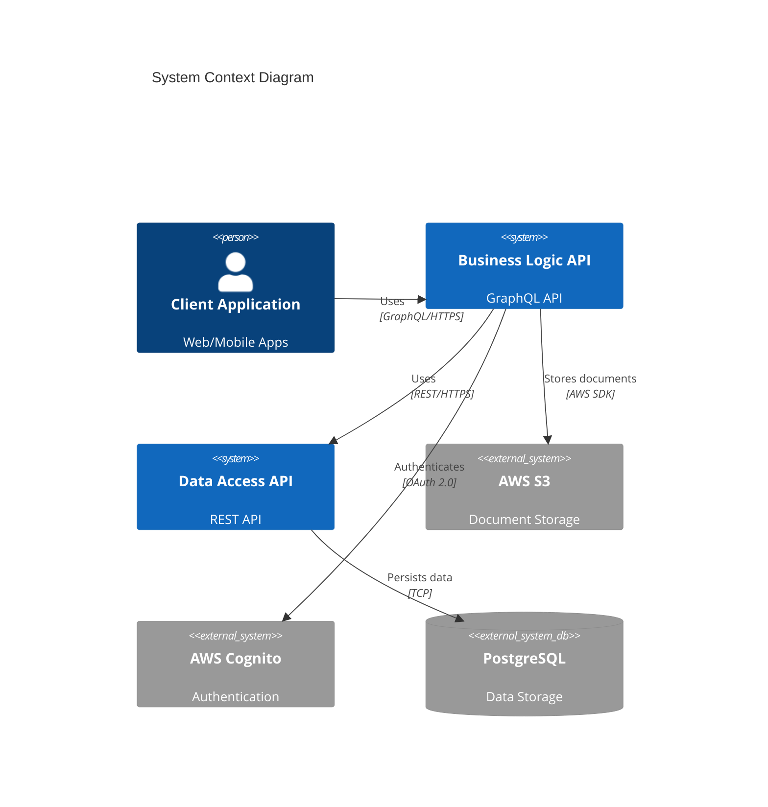

# EstateKit Personal Information API

[](https://dev.azure.com/estatekit/api)
[](https://codecov.io/gh/estatekit/api)
[](https://snyk.io/test/github/estatekit/api)
[](LICENSE)

Enterprise-grade distributed system for secure personal information management, featuring a GraphQL Business Logic API and REST Data Access API.

## Architecture Overview

The system consists of two primary components operating in a distributed architecture:

1. **GraphQL Business Logic API**
   - Handles all client interactions
   - Processes document uploads and OCR
   - Manages business rules and validation
   - Integrates with AWS services

2. **REST Data Access API**
   - Provides exclusive database access
   - Manages data encryption/decryption
   - Enforces security protocols
   - Handles data persistence

### System Context Diagram



## Security Implementation

### Field-Level Encryption
- AES-256-GCM encryption for sensitive fields
- Key rotation every 90 days
- HSM-backed key storage
- Encryption at rest and in transit

### Authentication & Authorization
- OAuth 2.0 with JWT tokens
- AWS Cognito integration
- Role-based access control
- MFA support

### Audit Logging
- Comprehensive audit trails
- Tamper-evident logging
- Real-time security alerts
- Compliance reporting

### Compliance
- GDPR compliant
- SOC 2 certified
- HIPAA ready
- PCI DSS compliant

## Development Setup

### Prerequisites

- .NET Core SDK 9.0
- Docker Desktop 24.0+
- AWS CLI 2.0+
- kubectl 1.27+

### Local Environment Setup

1. Clone the repository:
```bash
git clone https://github.com/estatekit/api.git
cd api
```

2. Configure environment variables:
```bash
cp .env.example .env
# Edit .env with your local configuration
```

3. Start development environment:
```bash
docker-compose up -d
```

4. Initialize database:
```bash
dotnet ef database update
```

### Security Configuration

1. Configure AWS credentials:
```bash
aws configure
```

2. Set up encryption keys:
```bash
./scripts/setup-encryption.sh
```

3. Configure OAuth:
```bash
./scripts/configure-oauth.sh
```

## Deployment Guide

### Development Environment

```bash
# Deploy to development
./deploy.sh development
```

### Staging Environment

```bash
# Deploy to staging
./deploy.sh staging
```

### Production Environment

```bash
# Deploy to production with approval
./deploy.sh production --require-approval
```

## API Documentation

- GraphQL API Documentation: [/graphql/docs](https://api.estatekit.com/graphql/docs)
- REST API Documentation: [/api/docs](https://api.estatekit.com/api/docs)
- Swagger UI: [/swagger](https://api.estatekit.com/swagger)

## Contributing

1. Fork the repository
2. Create your feature branch (`git checkout -b feature/amazing-feature`)
3. Commit your changes (`git commit -m 'Add amazing feature'`)
4. Push to the branch (`git push origin feature/amazing-feature`)
5. Open a Pull Request

## Security

For security concerns, please email security@estatekit.com. Do not create public issues for security vulnerabilities.

## License

This project is licensed under the MIT License - see the [LICENSE](LICENSE) file for details.

## Support

- Documentation: [docs.estatekit.com](https://docs.estatekit.com)
- Issues: [GitHub Issues](https://github.com/estatekit/api/issues)
- Email: support@estatekit.com

## Project Status

- Build Status: [Azure DevOps Pipeline](https://dev.azure.com/estatekit/api)
- Code Quality: [SonarCloud Dashboard](https://sonarcloud.io/dashboard?id=estatekit_api)
- Security Status: [Snyk Security Report](https://snyk.io/test/github/estatekit/api)